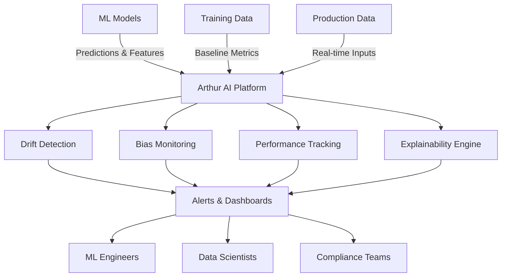
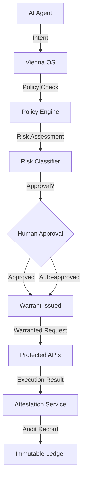

# Vienna OS vs Arthur AI: When You Need More Than Monitoring

You've invested millions in AI infrastructure. Your models are performing well in production. Your monitoring dashboards are green. But then your customer service agent processes 10,000 refunds in an hour, your deployment agent overwrites production with test data, or your trading algorithm decides to short your own company's stock.

**Model monitoring caught none of these incidents. Because the models worked perfectly.**

This is the gap between **model monitoring** (what Arthur AI does brilliantly) and **execution governance** (what Vienna OS provides). One watches your models think; the other governs what your agents do. Both are critical, but they solve fundamentally different problems.

## The Tale of Two Problems

### The Arthur AI Problem: "Is My Model Working?"

Arthur AI was built to solve the model observability crisis. When you deploy machine learning models to production, you need answers to critical questions:

- **Is my model still accurate?** Data drift can silently degrade performance
- **Are predictions biased?** Fairness metrics need continuous monitoring  
- **What data is my model seeing?** Input distributions change over time
- **How confident should I be?** Prediction confidence scores matter
- **Which features matter most?** Model explainability for compliance

Arthur AI excels at this. It's your mission control for model health, providing dashboards, alerts, and insights that keep your ML operations running smoothly. When your fraud detection model starts seeing unusual transaction patterns, Arthur AI alerts you. When your recommendation engine's click-through rates drop, Arthur AI helps you understand why.

### The Vienna OS Problem: "Should My Agent Do That?"

But model monitoring doesn't answer a different, equally critical question: **Should my AI agent be allowed to take this action right now?**

This is the execution governance problem. Your models might be working perfectly, but your agents can still:
- **Exceed their authority**: A customer service agent trying to issue million-dollar refunds
- **Violate business rules**: A deployment agent pushing code during a change freeze
- **Create compliance risks**: A data processing agent accessing customer PII without proper approval
- **Make costly mistakes**: A trading agent placing orders that exceed risk limits

Vienna OS addresses this by governing agent *actions*, not just monitoring model *performance*. Every action requires explicit authorization through cryptographically signed warrants that encode business rules, compliance requirements, and risk constraints.

## When You Need Each Solution

### Choose Arthur AI When:
- **Your models are complex** and you need deep ML observability
- **Model performance matters more than action governance** (research, analytics)
- **You're primarily concerned with model drift, bias, and explainability**
- **Your AI systems are primarily predictive** rather than action-oriented
- **You need to satisfy model risk management (MRM) requirements**

### Choose Vienna OS When:
- **Your agents take actions** that affect business operations
- **You need to enforce business rules** on agent behavior
- **Compliance requires audit trails** of agent decisions
- **Different agents need different permission levels**
- **You want just-in-time authorization** instead of permanent API keys

### Use Both When:
You're running production AI systems at scale. Arthur AI ensures your models are healthy; Vienna OS ensures your agents are well-behaved. They're complementary, not competitive.

## Feature Comparison Matrix

| **Capability** | **Arthur AI** | **Vienna OS** | **Why the Difference?** |
|----------------|---------------|---------------|-------------------------|
| **Model Performance Monitoring** | ✅ Comprehensive | ❌ Not applicable | Arthur AI built for ML observability |
| **Data Drift Detection** | ✅ Advanced algorithms | ❌ Not applicable | Different problem domain |
| **Bias & Fairness Monitoring** | ✅ Multi-metric support | ❌ Not applicable | Model-level vs action-level |
| **Model Explainability** | ✅ SHAP, LIME integration | ❌ Not applicable | Explains predictions, not permissions |
| **Action Authorization** | ❌ Not applicable | ✅ Intent-based warrants | Arthur AI doesn't govern actions |
| **Business Rule Enforcement** | ❌ Limited | ✅ Policy-as-code | Vienna OS built for governance |
| **Audit Trails** | ✅ Model predictions | ✅ Agent actions | Different audit scopes |
| **Real-time Governance** | ❌ Monitoring only | ✅ Just-in-time approval | Vienna OS intercepts before action |
| **Human-in-the-loop** | ✅ Alert notifications | ✅ Approval workflows | Different intervention points |
| **API Security** | ❌ Not applicable | ✅ Warrant-based access | Vienna OS manages API permissions |
| **Multi-tenant Isolation** | ✅ Enterprise features | ✅ Native design | Both handle enterprise requirements |
| **Integration Complexity** | Medium (model instrumentation) | Medium (SDK integration) | Both require architectural changes |

## Architecture: Observation vs Governance

### Arthur AI Architecture: The Observatory



Arthur AI sits **alongside** your ML pipeline, observing inputs and outputs, calculating metrics, and alerting teams when models drift or degrade. It's passive monitoring—incredibly valuable, but it doesn't prevent bad actions.

### Vienna OS Architecture: The Gatekeeper



Vienna OS sits **between** your agent and the actions it wants to take. Every action requires explicit authorization. It's active governance—preventing problems before they happen.

## Real-World Scenario: E-commerce AI Agent

Let's walk through a concrete example showing how Arthur AI and Vienna OS work together:

### The Setup
You have an AI-powered customer service agent that handles refunds, order modifications, and account updates. It uses:
- A fine-tuned language model for intent classification
- A sentiment analysis model for escalation decisions  
- A fraud detection model for transaction verification

### Arthur AI's Role: Model Health
Arthur AI monitors all three models:

```javascript
// Arthur AI monitoring setup
import { ArthurAI } from '@arthur-ai/python-sdk';

// Monitor intent classification model
arthur.log_prediction(
  model_id='intent-classifier-v2',
  prediction={
    'intent': 'refund_request',
    'confidence': 0.87,
    'features': customer_message_embedding
  }
);

// Monitor sentiment model
arthur.log_prediction(
  model_id='sentiment-analyzer-v1', 
  prediction={
    'sentiment': 'frustrated',
    'score': -0.65,
    'explanation': ['late delivery', 'poor quality']
  }
);
```

Arthur AI alerts you when:
- **Intent classification accuracy drops** below 90%
- **Sentiment model shows bias** toward certain customer segments
- **Feature distributions drift** from training data
- **Prediction confidence scores** become unreliable

### Vienna OS's Role: Action Governance
Vienna OS governs what the agent does with those model predictions:

```javascript
// Vienna OS governance integration
import { ViennaOS } from '@vienna-os/sdk';

// Agent wants to process a refund
const intent = await vienna.submitIntent({
  action: 'stripe.refund.create',
  target: order_id,
  parameters: {
    amount: refund_amount,
    reason: classification_result.intent
  },
  context: {
    customer_sentiment: sentiment_result.sentiment,
    fraud_score: fraud_result.risk_score,
    agent_confidence: classification_result.confidence
  }
});
```

Vienna OS enforces policies like:
- **Refunds over $100** require human approval  
- **Frustrated customers** get expedited processing
- **Low model confidence** triggers human review
- **Bulk refund patterns** get automatically blocked

### The Integration: Better Together

```javascript
// Combined Arthur AI + Vienna OS workflow
async function handleCustomerRequest(message, customer_id) {
  // Step 1: Use models to understand the request
  const intent = await intentModel.predict(message);
  const sentiment = await sentimentModel.predict(message);
  const fraud_risk = await fraudModel.predict(customer_id);
  
  // Step 2: Arthur AI logs all predictions for monitoring
  await arthur.logBatch([
    { model: 'intent', prediction: intent },
    { model: 'sentiment', prediction: sentiment }, 
    { model: 'fraud', prediction: fraud_risk }
  ]);
  
  // Step 3: Vienna OS governs the resulting action
  const governedAction = await vienna.submitIntent({
    action: mapIntentToAction(intent.intent),
    parameters: buildActionParams(intent, customer_id),
    context: {
      model_confidence: intent.confidence,
      customer_sentiment: sentiment.sentiment,
      fraud_score: fraud_risk.score
    }
  });
  
  // Step 4: Execute if approved
  if (governedAction.status === 'approved') {
    const result = await vienna.execute(governedAction.warrant);
    return result;
  } else {
    return { status: 'requires_approval', url: governedAction.approval_url };
  }
}
```

**Arthur AI ensures your models are making good predictions. Vienna OS ensures your agents are making safe actions.**

## Cost and Complexity Comparison

### Arthur AI Investment

**Initial Setup:**
- Model instrumentation across your ML pipeline
- Integration with training and inference infrastructure
- Dashboard configuration and alert tuning
- Team training on ML observability concepts

**Ongoing Costs:**
- Per-prediction logging fees (volume-based pricing)
- Platform subscription (enterprise features)
- Dedicated ML observability engineer time
- Model retraining when Arthur AI detects drift

**ROI Timeline:** 3-6 months (prevents model degradation incidents)

### Vienna OS Investment

**Initial Setup:**
- SDK integration in agent codebases
- Policy definition and testing
- Warrant verification in protected services
- Human approval workflow configuration

**Ongoing Costs:**
- Per-intent processing fees (action-based pricing)
- Platform subscription (governance features)
- Dedicated AI governance engineer time
- Policy maintenance and refinement

**ROI Timeline:** 1-3 months (prevents costly agent mistakes)

### Combined Investment

**Synergies:**
- Shared audit and compliance infrastructure
- Joint alerting and incident response
- Coordinated model health + action governance dashboards
- Cross-platform analytics on model performance vs agent behavior

**Total Cost Savings:** ~30% compared to building internal solutions

## Migration Strategies

### From Arthur AI to Vienna OS
**When:** You realize that model monitoring isn't enough—you need action governance.

```javascript
// Phase 1: Add Vienna OS alongside Arthur AI
// Keep existing Arthur AI monitoring
const arthurResponse = await arthur.logPrediction(model_prediction);

// Add Vienna OS governance for actions
const intent = await vienna.submitIntent({
  action: determineAction(model_prediction),
  context: { arthur_prediction_id: arthurResponse.id }
});

// Phase 2: Link governance decisions to model health
vienna.addPolicyRule({
  condition: "context.model_confidence < 0.8",
  action: "require_human_approval",
  reason: "Low model confidence detected by Arthur AI"
});
```

### From Vienna OS to Arthur AI
**When:** Your governance is solid, but you need visibility into model health.

```javascript
// Phase 1: Add Arthur AI monitoring to Vienna OS-governed actions
await vienna.execute(warrant, {
  onPredict: async (modelInput, modelOutput) => {
    await arthur.logPrediction({
      model_id: 'agent-decision-model',
      input: modelInput,
      output: modelOutput,
      vienna_intent_id: warrant.intent_id
    });
  }
});

// Phase 2: Use Arthur AI insights to improve Vienna OS policies
arthur.onAlert('model_drift', async (alert) => {
  await vienna.updatePolicy({
    policy_id: 'model-confidence-gate',
    new_threshold: alert.recommended_threshold
  });
});
```

## Vendor Comparison: The Enterprise Decision

### Arthur AI Strengths
- **ML-native platform** built by former Google AI researchers
- **Deep model observability** with advanced drift detection algorithms
- **Strong enterprise adoption** in regulated industries
- **Extensive model support** (scikit-learn, TensorFlow, PyTorch, etc.)
- **Proven ROI** in preventing model performance degradation

### Vienna OS Strengths  
- **AI governance focus** designed specifically for agent authorization
- **Real-time enforcement** prevents problems instead of detecting them after
- **Policy-as-code approach** makes business rules executable and auditable
- **Cryptographic security** with warrant-based access control
- **Built for the agent era** where AI systems take actions, not just predictions

### Decision Framework

**Choose Arthur AI as your primary platform if:**
- Model performance is your biggest risk
- You're in a heavily regulated industry (financial services, healthcare)
- Your AI systems are primarily analytical rather than operational
- You have a large ML engineering team focused on model ops

**Choose Vienna OS as your primary platform if:**
- Agent actions are your biggest risk  
- You need to enforce business rules on AI behavior
- Your AI systems affect business operations directly
- You have limited ML ops resources but need governance now

**Use both platforms if:**
- You're running production AI at scale (recommended for enterprise)
- Budget allows for best-in-class tools in both categories
- You have dedicated teams for both ML ops and AI governance

## Implementation Roadmap

### Months 1-2: Assessment Phase
- **Arthur AI**: Inventory existing models, assess monitoring gaps
- **Vienna OS**: Map agent actions, identify governance requirements
- **Decision**: Choose primary platform based on biggest risk area

### Months 3-4: Initial Deployment
- **If Arthur AI first**: Deploy model monitoring, establish baselines
- **If Vienna OS first**: Implement basic governance for highest-risk actions
- **Integration planning**: Design combined architecture if using both

### Months 5-6: Full Integration
- Deploy second platform if using both
- Establish cross-platform workflows and alerting
- Train teams on combined operational procedures

### Months 7-12: Optimization
- Refine policies and monitoring thresholds based on production experience
- Implement advanced features (custom metrics, complex policies)
- Measure ROI and business impact

## The Bottom Line

Arthur AI and Vienna OS solve different but complementary problems:

**Arthur AI answers:** "Are my AI models healthy and making good predictions?"
**Vienna OS answers:** "Should my AI agents be allowed to take this action?"

Both questions matter. A healthy model making good predictions is worthless if the agent uses those predictions to take harmful actions. Conversely, perfect governance is meaningless if your models are making terrible predictions.

**For small teams:** Start with whichever problem is causing more pain right now. Model degradation incidents or agent governance failures—fix the bigger fire first.

**For enterprise teams:** You need both. Arthur AI provides the model observability that your ML engineering team requires. Vienna OS provides the execution governance that your business and compliance teams demand.

The future belongs to organizations that can both *monitor their AI models* and *govern their AI agents*. Arthur AI and Vienna OS, together, provide that comprehensive coverage.

---

**Ready to evaluate Vienna OS for your AI governance needs?**

Start with a [free trial](https://console.regulator.ai) to see how execution governance complements your existing monitoring. Compare our [feature set](/compare) with other solutions, or explore our [documentation](/docs) to understand how Vienna OS integrates with your current stack.

For technical discussions about Arthur AI vs Vienna OS architectures, join our [GitHub community](https://github.com/vienna-os/vienna-os) or [book a comparison call](/try).

*Your models are monitored. Are your agents governed?*