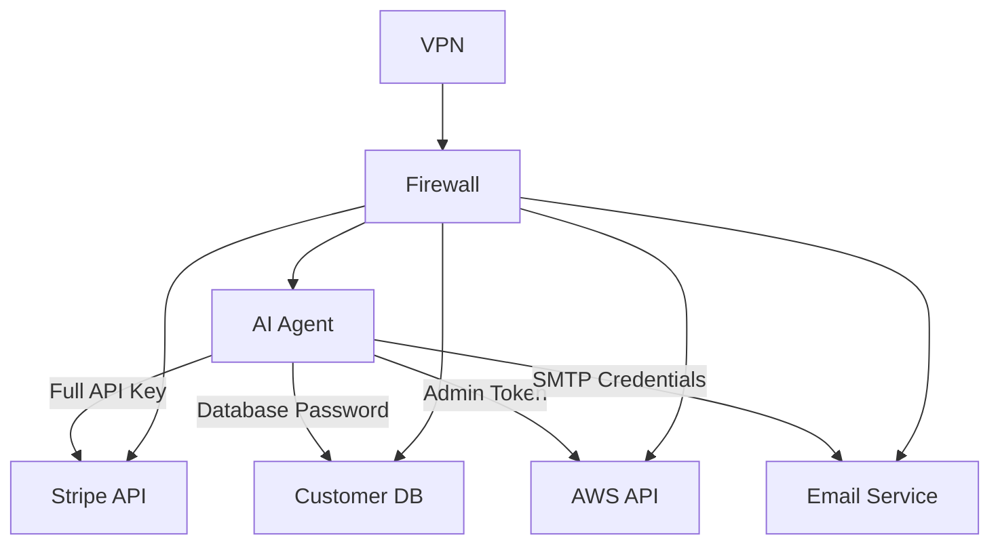
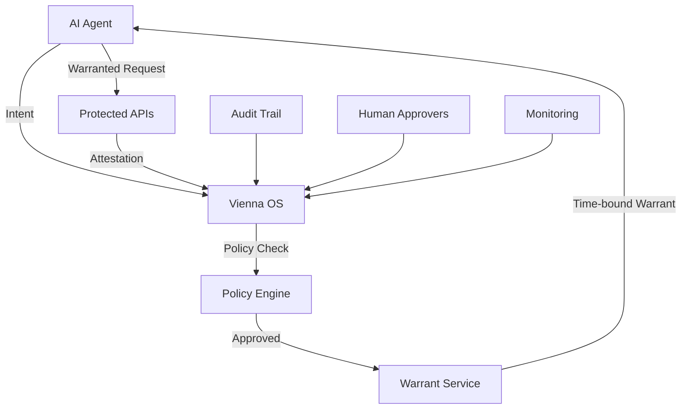

# Building a Zero-Trust AI Agent Pipeline

Traditional network security operates on the principle of "trust but verify" — establish a secure perimeter, and everything inside is trusted. But AI agents break this model entirely. They operate across cloud boundaries, interact with dozens of services, and make decisions that can impact your entire business. When an AI agent has the power to deploy code, manage infrastructure, or process customer data, "trust but verify" becomes "trust and pray."

**The solution: Zero-trust architecture for AI agents.** Never trust, always verify, every action, every time.

## Why Zero-Trust Applies to AI Agents

### The Traditional Security Perimeter is Dead

In the pre-agent era, your security perimeter was your network boundary. Deploy a firewall, configure VPNs, and monitor ingress/egress traffic. But AI agents operate fundamentally differently:

- **Cross-boundary execution**: Agents call APIs across multiple clouds, services, and domains
- **Dynamic privilege escalation**: An agent might need database access one minute, S3 permissions the next
- **Autonomous decision-making**: No human in the loop means no human to catch mistakes
- **Lateral movement potential**: A compromised agent can access everything in its permission set

Consider this scenario: Your customer service agent has Stripe API access to process refunds. Traditional security gives it a Stripe API key and trusts it to use it responsibly. But what if the agent gets confused and processes 1,000 refunds instead of 1? What if a prompt injection attack tricks it into refunding all transactions from last month?

**Zero-trust principles solve this**: Instead of trusting the agent with permanent Stripe access, Vienna OS issues time-bound warrants for specific operations. Want to refund order #12345? Get a warrant for that specific order. Want to refund 50 orders? That requires additional approval and stronger constraints.

### The Four Pillars of Zero-Trust for AI Agents

#### 1. **Intent-Based Authorization**
Instead of role-based permissions ("this agent can access Stripe"), Vienna OS uses intent-based authorization ("this agent wants to refund order #12345"). Every action starts with a declared intent:

```javascript
// Traditional approach - dangerous
const stripe = new Stripe(process.env.STRIPE_SECRET_KEY);
await stripe.refunds.create({ payment_intent: "pi_12345" });

// Zero-trust approach - governed
const intent = await vienna.submitIntent({
  action: "stripe.refund.create",
  target: "pi_12345",
  amount: 2500,
  reason: "customer_complaint",
  agent_id: "customer-service-001"
});
```

#### 2. **Policy-Driven Constraints**
Every intent gets evaluated against a policy framework that checks business rules, compliance requirements, and risk thresholds:

```yaml
# Refund policy example
policies:
  - name: "refund-amount-limit"
    condition: "intent.amount <= 5000" # $50 max refund
    action: "allow"
  
  - name: "bulk-refund-protection" 
    condition: "count(agent.refunds, last_hour) > 5"
    action: "require_human_approval"
  
  - name: "suspicious-pattern"
    condition: "intent.reason == 'test' OR intent.amount > order.amount"
    action: "deny"
```

#### 3. **Cryptographic Warrants**
Approved intents receive time-bound, cryptographically signed warrants that prove authorization. No warrant, no execution:

```javascript
// Warrant structure
{
  "scope": "api.stripe.com/refunds",
  "action": "create", 
  "constraints": {
    "payment_intent": "pi_12345",
    "max_amount": 2500,
    "expires_at": "2026-03-28T15:30:00Z"
  },
  "hmac": "sha256:7f3c8d2a1b9e4f6c8d7a2b1c9e8f4d3a2b6c8f7e1d9a4c2b8f6e3d1a7c9b2e4f"
}
```

#### 4. **Continuous Verification**
Every API call includes warrant verification. The receiving service (or Vienna OS proxy) validates the warrant before processing:

```javascript
// Service-side warrant validation
app.post('/api/refund', authenticateWarrant, (req, res) => {
  const warrant = req.warrant;
  
  // Verify warrant is for this specific operation
  if (warrant.scope !== 'api.stripe.com/refunds') {
    return res.status(403).json({ error: 'Invalid warrant scope' });
  }
  
  // Check constraints
  if (req.body.amount > warrant.constraints.max_amount) {
    return res.status(403).json({ error: 'Amount exceeds warrant limit' });
  }
  
  // Proceed with refund...
});
```

## How Vienna OS Implements Zero-Trust

### The Vienna OS Governance Flow

Vienna OS implements zero-trust through a five-stage pipeline: **Intent → Policy → Warrant → Execution → Verification**. Let's walk through each stage:

#### Stage 1: Intent Submission
Every action starts with an intent. The agent declares what it wants to do, why, and provides all necessary context:

```javascript
const vienna = new ViennaOS({
  apiKey: process.env.VIENNA_API_KEY,
  endpoint: "https://console.regulator.ai/api/v1"
});

const intent = await vienna.submitIntent({
  // What action?
  action: "database.users.update",
  
  // What target?
  target: "user_abc123",
  
  // What changes?
  parameters: {
    email: "newemail@example.com",
    updated_reason: "customer_support_request"
  },
  
  // Who's asking?
  agent_id: "customer-support-agent-001",
  
  // Why?
  justification: "Customer called to update email address",
  
  // Business context
  metadata: {
    ticket_id: "SUPPORT-7890",
    customer_tier: "premium",
    urgency: "normal"
  }
});
```

#### Stage 2: Policy Evaluation
Vienna OS evaluates the intent against your policy framework. Policies are written in a declarative language that maps business rules to technical constraints:

```yaml
# User data modification policy
- name: "customer-data-protection"
  description: "Protect customer PII from unauthorized changes"
  
  conditions:
    - action: "database.users.update"
    - target_type: "user_record"
  
  rules:
    # Only customer support can modify user data
    - if: "agent_id.startsWith('customer-support')"
      then: "continue_evaluation"
    - else: "deny"
    
    # Email changes require ticket reference
    - if: "parameters.email AND NOT metadata.ticket_id"
      then: "deny"
    - message: "Email changes require support ticket"
    
    # PII changes on premium customers need extra verification  
    - if: "metadata.customer_tier == 'premium' AND parameters.email"
      then: "require_human_approval"
    - approval_level: "tier2_support"
    
    # Otherwise, allow with constraints
    - then: "allow"
    - constraints:
        rate_limit: "10 per hour"
        audit_level: "detailed"
```

#### Stage 3: Warrant Generation
Approved intents receive cryptographically signed warrants. These warrants contain everything needed for secure execution:

```javascript
// Generated warrant
{
  "warrant_id": "warrant_abc123",
  "intent_id": "intent_def456", 
  "issued_at": "2026-03-28T14:00:00Z",
  "expires_at": "2026-03-28T15:00:00Z",
  
  "scope": "database.users.update/user_abc123",
  "action": "update",
  
  "constraints": {
    "allowed_fields": ["email", "updated_reason"],
    "max_field_length": 255,
    "rate_limit": "10 per hour",
    "audit_required": true
  },
  
  "attestation_required": true,
  "risk_tier": "T1", // T0-T3 classification
  
  // HMAC signature prevents tampering
  "hmac": "sha256:a1b2c3d4e5f6789012345678901234567890abcdef1234567890abcdef123456"
}
```

#### Stage 4: Governed Execution
The agent uses the warrant to execute the action. Vienna OS provides SDKs that handle warrant attachment automatically:

```javascript
// SDK automatically attaches warrant
const result = await vienna.execute(intent.warrant_id, {
  target: "user_abc123",
  updates: {
    email: "newemail@example.com",
    updated_reason: "customer_support_request"  
  }
});

// Raw API call (if not using SDK)
const response = await fetch('https://api.yourservice.com/users/abc123', {
  method: 'PATCH',
  headers: {
    'Authorization': `Bearer ${api_token}`,
    'X-Vienna-Warrant': warrant.signature,
    'Content-Type': 'application/json'
  },
  body: JSON.stringify({
    email: "newemail@example.com",
    updated_reason: "customer_support_request"
  })
});
```

#### Stage 5: Verification and Attestation
After execution, Vienna OS verifies the action succeeded and creates an immutable attestation record:

```javascript
// Automatic attestation generation
{
  "attestation_id": "att_xyz789",
  "warrant_id": "warrant_abc123",
  "executed_at": "2026-03-28T14:30:15Z",
  
  "result": {
    "status": "success",
    "affected_records": 1,
    "response_time_ms": 245
  },
  
  "verification": {
    "warrant_valid": true,
    "constraints_met": true,
    "rate_limits_ok": true,
    "audit_logged": true
  },
  
  // Cryptographic proof of execution
  "signature": "rsa256:def456abc789...",
  "immutable": true
}
```

### Risk-Based Tiering (T0-T3)

Vienna OS classifies every action into risk tiers that determine governance requirements:

#### **T0 - Read-Only Operations**
- **Examples**: Database queries, file reads, status checks
- **Governance**: Lightweight warrant, 24h validity, bulk approval possible
- **Constraints**: Rate limiting, query complexity limits
```yaml
tier: T0
warrant_validity: "24h" 
bulk_operations: true
approval_required: false
```

#### **T1 - Low-Impact Modifications**
- **Examples**: Log writes, cache updates, non-customer data changes  
- **Governance**: Standard warrant, 1h validity, automatic approval
- **Constraints**: Field validation, business rule enforcement
```yaml
tier: T1
warrant_validity: "1h"
approval_required: false
constraints: ["field_validation", "business_rules"]
```

#### **T2 - Business-Critical Operations**
- **Examples**: Customer data changes, payment processing, configuration updates
- **Governance**: Strict warrant, 15min validity, may require human approval
- **Constraints**: Multi-factor verification, detailed audit logging
```yaml
tier: T2
warrant_validity: "15min"
approval_required: "conditional" # Based on policy
constraints: ["mfa_required", "detailed_audit", "rollback_plan"]
```

#### **T3 - High-Risk Operations**
- **Examples**: System administration, bulk operations, irreversible actions
- **Governance**: Ultra-strict warrant, 5min validity, always requires human approval
- **Constraints**: Multi-person approval, complete audit trail, mandatory rollback plan
```yaml
tier: T3
warrant_validity: "5min"
approval_required: "always"
constraints: ["multi_person_approval", "complete_audit", "rollback_mandatory"]
```

## Code Examples: Implementing Zero-Trust

### Basic Integration

```javascript
// 1. Initialize Vienna OS client
const vienna = new ViennaOS({
  apiKey: process.env.VIENNA_API_KEY,
  endpoint: "https://console.regulator.ai/api/v1",
  tenant_id: "your-org"
});

// 2. Submit intent instead of direct action
async function processCustomerRefund(orderId, amount, reason) {
  // Traditional (unsafe) approach:
  // return await stripe.refunds.create({ payment_intent: orderId, amount });
  
  // Zero-trust approach:
  const intent = await vienna.submitIntent({
    action: "stripe.refund.create",
    target: orderId,
    parameters: { amount, reason },
    agent_id: process.env.AGENT_ID,
    justification: `Customer refund: ${reason}`
  });
  
  if (intent.status === 'approved') {
    return await vienna.execute(intent.warrant_id);
  } else if (intent.status === 'requires_approval') {
    return { status: 'pending', approval_url: intent.approval_url };
  } else {
    throw new Error(`Intent denied: ${intent.denial_reason}`);
  }
}
```

### Advanced Policy Configuration

```yaml
# Complex multi-stage policy
policies:
  - name: "financial-operations-governance" 
    scope: "stripe.*"
    
    stages:
      # Stage 1: Authentication & authorization
      - name: "verify-agent"
        conditions:
          - agent_id.verified == true
          - agent_permissions.includes(intent.action)
        actions:
          deny_if_false: "Agent not authorized for financial operations"
      
      # Stage 2: Business rule validation  
      - name: "validate-business-rules"
        conditions:
          - if: "action == 'refund.create'"
            then:
              - amount <= 10000  # $100 max
              - reason != null
              - target.exists_in("processed_payments")
        actions:
          deny_if_false: "Business rule validation failed"
      
      # Stage 3: Risk assessment
      - name: "assess-risk"
        conditions:
          - if: "amount > 5000 OR count(agent.refunds, today) > 3"
            then: 
              risk_tier: "T2"
              require_approval: true
              approval_timeout: "1h"
          - else:
              risk_tier: "T1" 
              auto_approve: true
      
      # Stage 4: Constraint application
      - name: "apply-constraints"
        constraints:
          warrant_validity: 
            T1: "1h"
            T2: "15min"
          rate_limits:
            T1: "10 per hour"
            T2: "3 per hour"
          audit_level:
            T1: "standard"
            T2: "detailed"
```

### Warrant Verification Middleware

```javascript
// Express middleware for warrant verification
function verifyWarrant(req, res, next) {
  const warrant = req.headers['x-vienna-warrant'];
  
  if (!warrant) {
    return res.status(401).json({ 
      error: 'Warrant required',
      message: 'All governed actions require a valid Vienna OS warrant' 
    });
  }
  
  try {
    // Verify HMAC signature
    const [header, signature] = warrant.split('.');
    const decoded = JSON.parse(Buffer.from(header, 'base64').toString());
    
    const expectedSignature = crypto
      .createHmac('sha256', process.env.VIENNA_WEBHOOK_SECRET)
      .update(header)
      .digest('hex');
    
    if (signature !== expectedSignature) {
      return res.status(403).json({ error: 'Invalid warrant signature' });
    }
    
    // Check expiration
    if (Date.now() > decoded.expires_at * 1000) {
      return res.status(403).json({ error: 'Warrant expired' });
    }
    
    // Verify scope matches endpoint
    const expectedScope = `${req.method} ${req.path}`;
    if (decoded.scope !== expectedScope) {
      return res.status(403).json({ error: 'Warrant scope mismatch' });
    }
    
    // Attach warrant to request
    req.warrant = decoded;
    next();
    
  } catch (error) {
    return res.status(400).json({ 
      error: 'Malformed warrant',
      details: error.message 
    });
  }
}

// Apply to protected routes
app.use('/api/admin/*', verifyWarrant);
app.use('/api/financial/*', verifyWarrant);
app.use('/api/customer-data/*', verifyWarrant);
```

## Zero-Trust vs Traditional Agent Architectures

### Traditional Architecture: Castle and Moat



**Problems:**
- Agent has permanent, broad permissions
- Single point of failure (compromised agent = full access)
- No visibility into what agent actually does
- Difficult to enforce business rules
- Compliance audit nightmare

### Zero-Trust Architecture: Never Trust, Always Verify



**Benefits:**
- **Principle of least privilege**: Agent gets exactly what it needs, when it needs it
- **Time-bound access**: Warrants expire automatically
- **Complete audit trail**: Every action is logged and attested
- **Policy enforcement**: Business rules are code, not documentation
- **Incident containment**: Compromised agent has limited blast radius

### Feature Comparison

| Feature | Traditional | Zero-Trust (Vienna OS) |
|---------|-------------|------------------------|
| **Permission Model** | Role-based (permanent) | Intent-based (temporal) |
| **Access Duration** | Indefinite | Time-bound warrants |
| **Business Rules** | Documentation | Executable policies |
| **Audit Trail** | Application logs | Cryptographic attestations |
| **Incident Response** | Revoke all access | Targeted warrant revocation |
| **Compliance** | Manual reviews | Automated evidence |
| **Risk Management** | Binary (allow/deny) | Tiered (T0-T3) |
| **Human Oversight** | After-the-fact | Just-in-time |
| **Blast Radius** | Full API access | Single warrant scope |

## Implementation Checklist

### Phase 1: Assessment and Planning (Week 1)
- [ ] **Inventory existing agent permissions** - What APIs do your agents access?
- [ ] **Map business rules to policies** - What constraints should apply?
- [ ] **Identify high-risk operations** - What needs human approval?
- [ ] **Set up Vienna OS environment** - Deploy governance infrastructure

### Phase 2: Policy Development (Week 2)
- [ ] **Write intent schemas** - Define allowed actions and parameters
- [ ] **Create policy framework** - Implement business rules as code
- [ ] **Configure risk tiers** - Classify operations by impact (T0-T3)
- [ ] **Set up approval workflows** - Define who approves what

### Phase 3: Agent Integration (Week 3-4)
- [ ] **Install Vienna OS SDK** - Integrate with existing agent code
- [ ] **Replace direct API calls** - Convert to intent-based pattern
- [ ] **Add warrant verification** - Protect your services
- [ ] **Implement attestation logging** - Track all governed actions

### Phase 4: Testing and Rollout (Week 5-6)
- [ ] **Test policy edge cases** - What happens when things go wrong?
- [ ] **Load test warrant validation** - Ensure performance under load
- [ ] **Train operations team** - Who monitors and responds to alerts?
- [ ] **Gradual rollout** - Start with low-risk operations

### Phase 5: Monitoring and Optimization (Ongoing)
- [ ] **Monitor policy effectiveness** - Are rules catching problems?
- [ ] **Tune performance** - Optimize warrant validation times
- [ ] **Refine risk tiers** - Adjust T0-T3 classifications based on experience
- [ ] **Regular policy review** - Keep rules current with business needs

## Conclusion

Zero-trust architecture isn't just a security buzzword—it's the only viable approach for governing AI agents at scale. When your agents have the power to affect real business outcomes, "trust but verify" becomes "trust and pray." Vienna OS provides the governance infrastructure to never trust, always verify, every action, every time.

**The zero trust ai approach delivers:**
- **Reduced risk**: Time-bound warrants limit blast radius
- **Better compliance**: Cryptographic audit trails satisfy regulators  
- **Operational visibility**: See everything your agents do in real-time
- **Business rule enforcement**: Policies are code, not hope
- **Incident response**: Surgical response instead of nuclear shutdown

Traditional security assumed humans were making decisions. Zero-trust for AI assumes agents are making decisions—and puts the right guardrails in place.

---

**Ready to implement zero-trust for your AI agents?** 

Start with a [free Vienna OS trial](https://console.regulator.ai) or explore our [documentation](/docs) to see how intent-based governance works. For technical discussions, join our community on [GitHub](https://github.com/vienna-os/vienna-os) or book a [demo call](/try).

Your agents are already making decisions. Make sure they're making the right ones.